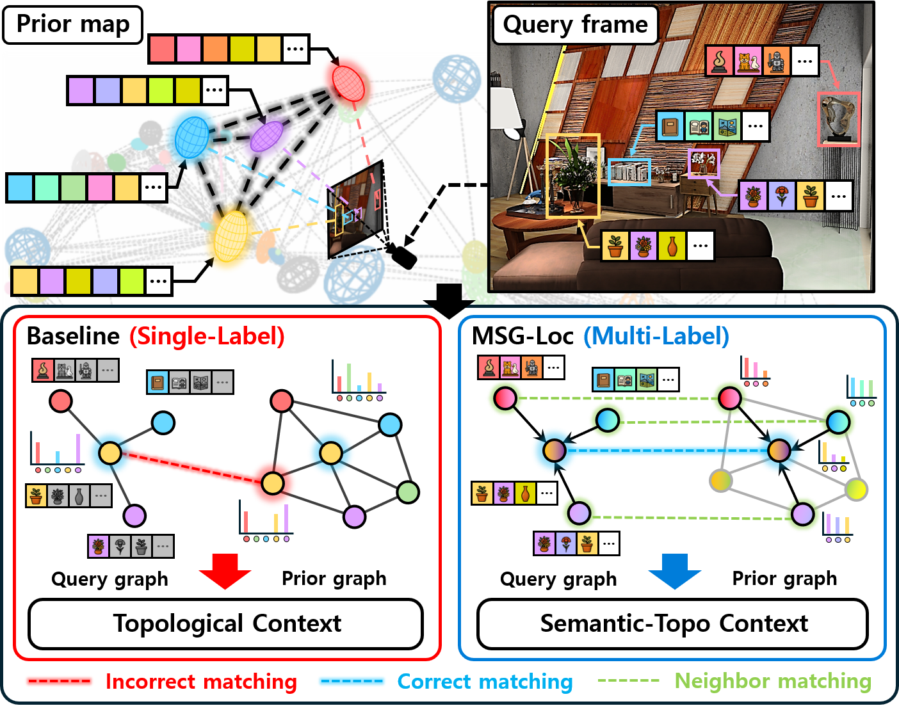

<div align="center">
  <h1>MSG-Loc</h1>

  <!-- Languages -->
  <a href="https://github.com/<YOUR_ORG>/<YOUR_REPO>"></a>
  <a href="https://github.com/<YOUR_ORG>/<YOUR_REPO>"></a>

  <!-- Project / Paper / Preprint / Media -->
  <a href="https://sparolab.github.io/research/msg-loc/"></a>
  <a href="https://doi.org/10.1109/LRA.2025.3643293"></a>
  <a href="https://doi.org/10.48550/arXiv.2512.03522"></a>
  <a href="<YOUR_YOUTUBE_URL>"></a>

  <br />
  <b>[IEEE RA-L'25]</b> This repository is the official implementation of
  <b>"MSG-Loc: Multi-Label Likelihood-based Semantic Graph Matching for Object-Level Global Localization"</b>.

  <br />

  <!-- Authors (replace href with your links; or remove href if you prefer plain text) -->
  <a href="https://scholar.google.com/citations?user=iKsImcYAAAAJ&hl=ko" target="_blank">Gihyeon Lee</a><sup></sup>,
  <a href="https://scholar.google.com/citations?hl=ko&user=H0rvKXYAAAAJ" target="_blank">Jungwoo Lee</a><sup></sup>,
  <a href="https://scholar.google.com/citations?hl=ko&user=2bvLmqQAAAAJ" target="_blank">Juwon Kim</a><sup></sup>,
  <a href="https://scholar.google.com/citations?user=gGfBRawAAAAJ&hl=ko" target="_blank">Young-Sik Shin</a><sup></sup>,
  <a href="https://scholar.google.com/citations?user=W5MOKWIAAAAJ&hl=ko" target="_blank">Younggun Cho</a><sup>†</sup>

  <br />

  <b>[Spatial AI and Robotics Lab (SPARO)](https://sparolab.github.io/)</b>

  <!-- Teaser image -->
  <p align="center">
    
  </p>

</div>

---

## NEWS
* [Dec, 2025] Project page is now available.
* [Nov, 2025] 🎉 MSG-Loc has been accepted by IEEE Robotics and Automation Letters (RA-L). 🎉


---

## Citation
If you find this repository useful, please consider citing:
```bibtex
@ARTICLE{lee2025msgloc,
            author={Lee, Gihyeon and Lee, Jungwoo and Kim, Juwon and Shin, Young-Sik and Cho, Younggun},
            journal={IEEE Robotics and Automation Letters},
            title={MSG-Loc: Multi-Label Likelihood-based Semantic Graph Matching for Object-Level Global Localization},
            year={2025},
            volume={},
            number={},
            pages={1-8},
            keywords={Semantics;Location awareness;Simultaneous localization and mapping;Uncertainty;Three-dimensional displays;Artificial intelligence;Object oriented modeling;Nearest neighbor methods;Pose estimation;Maximum likelihood estimation;Semantic Scene Understanding;Localization;Graph Matching;Object-based SLAM},
            doi={10.1109/LRA.2025.3643293}
        }
```
---
## Contact
* Gihyeon Lee (leekh951@inha.edu)
---
