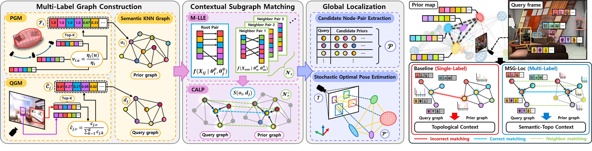

<div align="center">
  <h1>MSG-Loc</h1>
  <!-- Languages -->
  <!-- <a href="https://github.com/<YOUR_ORG>/<YOUR_REPO>"></a>
  <a href="https://github.com/<YOUR_ORG>/<YOUR_REPO>"></a> -->
  <!-- Project / Paper / Preprint / Media -->
  <a href="https://sparolab.github.io/research/msg-loc/"></a>
  <a href="https://doi.org/10.1109/LRA.2025.3643293"></a>
  <a href="https://doi.org/10.48550/arXiv.2512.03522"></a>
  <a href="<YOUR_YOUTUBE_URL>"></a>
  <br />
  <b>[IEEE RA-L'26]</b> This repository is the official implementation of
  <b>"MSG-Loc: Multi-Label Likelihood-based Semantic Graph Matching for Object-Level Global Localization"</b>.
  <br />
  <!-- Authors (replace href with your links; or remove href if you prefer plain text) -->
  <a href="https://scholar.google.com/citations?user=iKsImcYAAAAJ&hl=ko" target="_blank">Gihyeon Lee</a><sup></sup>,
  <a href="https://scholar.google.com/citations?hl=ko&user=H0rvKXYAAAAJ" target="_blank">Jungwoo Lee</a><sup></sup>,
  <a href="https://scholar.google.com/citations?hl=ko&user=2bvLmqQAAAAJ" target="_blank">Juwon Kim</a><sup></sup>,
  <a href="https://scholar.google.com/citations?user=gGfBRawAAAAJ&hl=ko" target="_blank">Young-Sik Shin</a><sup>†</sup>,
  <a href="https://scholar.google.com/citations?user=W5MOKWIAAAAJ&hl=ko" target="_blank">Younggun Cho</a><sup>†</sup>
  <br />
  
<b>[Inha University, Spatial AI and Robotics Lab (SPARO)](https://sparolab.github.io/)</b>
  <br />
  <b>[Korea Institute of Machinery & Materials (KIMM)](https://www.kimm.re.kr/)</b> & <b>[Kyungpook National University (KNU)](https://www.knu.ac.kr/)</b>
<!-- Demo GIFs -->
<p align="center">
  
  
</p>
  <!-- Teaser image -->
  <p align="center">
    
  </p>
</div>

---

## NEWS
* [Apr, 2026] Code has been released.
* [Dec, 2025] Project page is now available.
* [Nov, 2025] 🎉 MSG-Loc has been accepted by IEEE Robotics and Automation Letters (RA-L).

---

## Usage

### 1. Setup

The code is tested on:

- Ubuntu 20.04
- ROS Noetic
- CUDA 12.1.1
- CMake 3.22
- [gtsam_quadrics](https://github.com/qcr/gtsam-quadrics)

Docker image:

Pull the Docker image:

```code
docker pull leekh951/msg-loc:v1
```

Run the Docker container:

```code
xhost +local:root
docker run -it \
  --name msgloc_v1 \
  --gpus all \
  --network host \
  --ipc host \
  --privileged \
  -e DISPLAY=$DISPLAY \
  -e QT_X11_NO_MITSHM=1 \
  -e NVIDIA_DRIVER_CAPABILITIES=all \
  -v /tmp/.X11-unix:/tmp/.X11-unix:rw \
  leekh951/msg-loc:v1 \
  /bin/bash
```

Build the package:

```code
cd /root/workspace
mkdir -p src
git clone https://github.com/Leekh951/MSG-Loc.git src/MSG-Loc
source /opt/ros/noetic/setup.bash
catkin_make
source devel/setup.bash
```

Detailed command examples for each dataset are provided in:

```text
/root/workspace/src/MSG-Loc/scripts.txt
```

---

### 2. Dataset

Download the datasets and place them under `/root/workspace/dataset_root/`.

- [TUM RGB-D Dataset](https://cvg.cit.tum.de/data/datasets/rgbd-dataset/download)
  - Used sequence: `rgbd_dataset_freiburg2_desk`
- [ICL-LM Dataset](https://peringlab.org/lmdata/)
  - Used Diamond sequence: `diamond_walk`

---

### 3. Detection

TBU

---

### 4. SLAM

TBU

---

### 5. MSG-Loc

Run global localization:

```code
rosrun MSG-Loc test_node \
  _config:=/root/workspace/src/MSG-Loc/Config/config.yaml \
  _map_path:=/root/workspace/src/MSG-Loc/SLAM_results/<map>.json \
  _detection_path:=/root/workspace/src/MSG-Loc/Detection_results/<detections>.json \
  _base_path:=/root/workspace/dataset_root/<dataset> \
  _cam_info:=/root/workspace/src/MSG-Loc/Cameras/<camera>.yaml \
  _output_dir:=/root/workspace/src/MSG-Loc/MSG-Loc_results
```

Example for Fr2_desk:

```code
rosrun MSG-Loc test_node \
  _config:=/root/workspace/src/MSG-Loc/Config/config.yaml \
  _map_path:=/root/workspace/src/MSG-Loc/SLAM_results/desk_map.json \
  _detection_path:=/root/workspace/src/MSG-Loc/Detection_results/desk_gdino_lvis_detections.json \
  _base_path:=/root/workspace/dataset_root/rgbd_dataset_freiburg2_desk \
  _cam_info:=/root/workspace/src/MSG-Loc/Cameras/TUM2.yaml \
  _output_dir:=/root/workspace/src/MSG-Loc/MSG-Loc_results
```

The estimated trajectory is saved to `MSG-Loc_results/pose_results.txt`.

---

## Citation
If you find this repository useful, please consider citing:
```bibtex
@ARTICLE{lee2026msgloc,
  author={Lee, Gihyeon and Lee, Jungwoo and Kim, Juwon and Shin, Young-Sik and Cho, Younggun},
  journal={IEEE Robotics and Automation Letters}, 
  title={MSG-Loc: Multi-Label Likelihood-Based Semantic Graph Matching for Object-Level Global Localization}, 
  year={2026},
  volume={11},
  number={2},
  pages={2066-2073},
  keywords={Semantics;Location awareness;Simultaneous localization and mapping;Uncertainty;Three-dimensional displays;Artificial intelligence;Object oriented modeling;Nearest neighbor methods;Pose estimation;Maximum likelihood estimation;Semantic scene understanding;localization;graph matching;object-based SLAM},
  doi={10.1109/LRA.2025.3643293}
}
```

---

## Acknowledgement

We appreciate the open-source contributions of previous authors, and especially thank the authors of the following projects for releasing their code and models to the community:

- [GOReloc](https://github.com/yutongwangBIT/GOReloc)
- [Semantic Histogram](https://github.com/gxytcrc/semantic-histogram-based-global-localization)
- [Grounding DINO](https://github.com/idea-research/groundingdino)
- [Tokenize Anything via Prompting (TAP)](https://github.com/baaivision/tokenize-anything)
- [OVSAM](https://github.com/HarborYuan/ovsam)
- [Ultralytics/YOLOv8](https://github.com/ultralytics/ultralytics)

---

## Contact
* Gihyeon Lee (leekh951@inha.edu)

---
